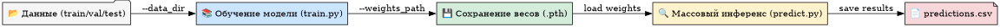

# Waste Classification (O / R) — PyTorch Lightning + ResNet18

## 📌 Описание проекта
Проект решает задачу классификации изображений отходов на 2 класса:

- **O** — органические отходы  
- **R** — перерабатываемые отходы  

Модель построена на основе **ResNet18** с возможностью **заморозки/разморозки backbone** и сохранением лучших весов для инференса.  
Обучение реализовано с использованием **PyTorch Lightning**.

---
## 📂 Структура репозитория
```text
├── models/ # Папка для сохранения весов и моделей
├── data/ # Папка с датасетом
│ └── DATASET/ # Структура train/val/test
├── src/ # Папка с скриптами
│ └── train_waste.py # Скрипт обучения модели
│ └── predict_waste.py # Скрипт массового инференса
├── requirements.txt # Зависимости проекта
└── README.md # Инструкция по запуску
└── .env # файл с переменными окружения
```
---

## 🛠 Установка и настройка окружения

1. **Клонируем репозиторий**
```bash
git clone https://github.com/meshvedov/waste-cv.git
cd waste-classification
```
2. **Создаём и активируем виртуальное окружение**
```bash
python -m venv venv
source venv/bin/activate   # для Linux / Mac
venv\Scripts\activate      # для Windows
```
3. **Устанавливаем зависимости**
```bash
pip install -r requirements.txt
```
## 📊 Подготовка данных
Данные должны быть в формате:
```text
data/DATASET/
    TRAIN/
        O/
        R/
    VAL/
        O/
        R/
    TEST/
        O/
        R/
```
📥 Для примера можно скачать набор данных с Kaggle:
[Waste Classification data (short)](https://www.kaggle.com/datasets/stanislav9801/waste-classification-data-trainvaltest-short)

## ⚙ Переменные окружения
Перед запуском рекомендуется задать переменные окружения в файле `.env` (особенно при использовании GPU или ClearML):
```bash
export PYTHONUNBUFFERED=1
export CLEARML_API_ACCESS_KEY="your_access_key"
export CLEARML_API_SECRET_KEY="your_secret_key"
export CLEARML_API_HOST="https://api.clear.ml"
export CLEARML_WEB_HOST="https://app.clear.ml"
export CLEARML_FILES_HOST="https://files.clear.ml"
```
## 🚀 Запуск обучения
**Синтаксис**
```bash
python train_waste.py \
    --fast_dev_run False \
    --clearml True \
    --epochs 10 \
    --data_dir data/DATASET \
    --weights_path models/waste_resnet18_best.pth \
    --lr 0.001 \
    --unfreeze_epoch 10
```
**Параметры:**
| Параметр           | Тип   | По умолчанию                     | Описание                                   |
| ------------------ | ----- | -------------------------------- | ------------------------------------------ |
| `--fast_dev_run`   | bool  | False                            | Запуск одной итерации для отладки          |
| `--clearml`        | bool  | False                            | Логирование в ClearML                      |
| `--epochs`         | int   | 10                               | Кол-во эпох                                |
| `--data_dir`       | str   | `data/DATASET`                   | Путь к данным                              |
| `--weights_path`   | str   | `models/waste_resnet18_best.pth` | Путь для сохранения весов                  |
| `--lr`             | float | 0.001                            | Learning rate                              |
| `--unfreeze_epoch` | int   | 10                               | Эпоха, на которой размораживается backbone |

## 🔍 Массовый инференс (predict_waste.py)
После обучения модель можно использовать для предсказаний на целой папке изображений.

**Пример запуска:**
```bash
python predict.py \
    --weights_path models/waste_resnet18_best.pth \
    --input_dir data/DATASET/test \
    --output_csv predictions.csv
```
**Параметры:**
| Параметр         | Тип | По умолчанию                     | Описание                                 |
| ---------------- | --- | -------------------------------- | ---------------------------------------- |
| `--weights_path` | str | `models/waste_resnet18_best.pth` | Путь к весам модели                      |
| `--input_dir`    | str | `data/DATASET/test`              | Папка с изображениями                    |
| `--output_csv`   | str | `predictions.csv`                | Путь для сохранения CSV с предсказаниями |

## 📈 Логирование в ClearML
Если параметр --clearml True, то все метрики и логи будут отправлены в ClearML.
Не забудьте задать переменные окружения с ключами API.

## 📜 Лицензия
Проект распространяется под лицензией MIT.

```